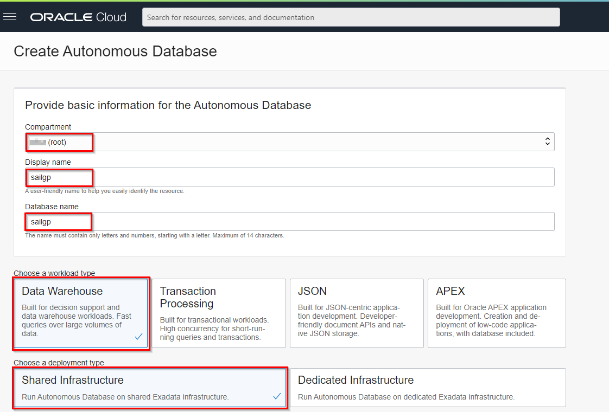
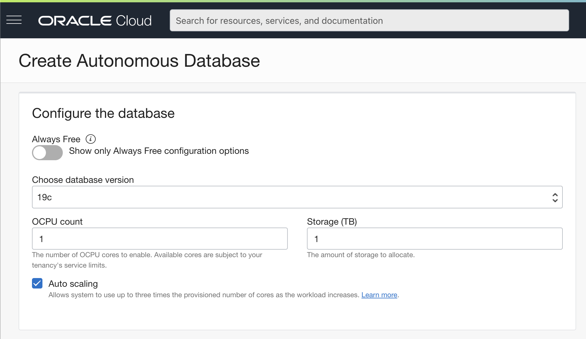
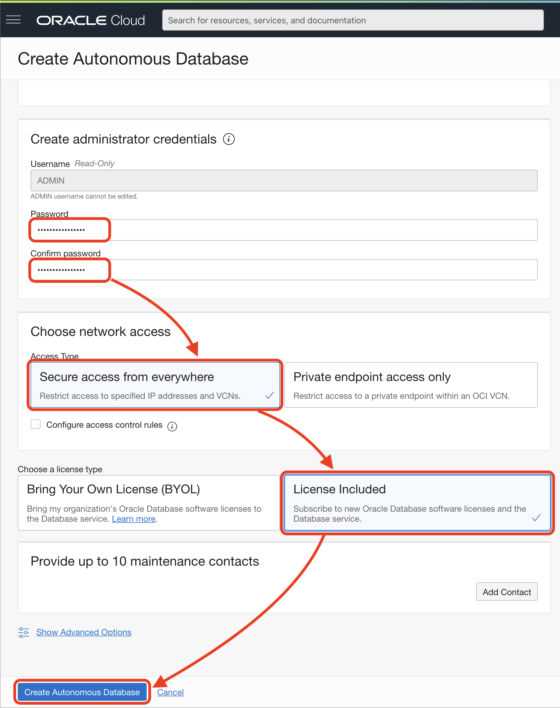

# Provision  Autonomous Data Warehouse

## Introduction

In this lab, you will get started with the Oracle Autonomous Database on Oracle Cloud. There are two types of workloads:

- Autonomous Data Warehouse (ADW)
- Autonomous Transaction Processing (ATP)

You will provision a new Autonomous Data Warehouse (ADW) instance.

> **Note:** While this lab uses ADW, the tasks are identical for creating an ATP database.

_Estimated Time:_ 5 minutes

### Objectives

In this lab, you will:

-   Learn how to provision a new Autonomous Database

### Prerequisites

This lab assumes you have:

- Logged into your Oracle Cloud Account

## Task 1: Provision ADW

1. Go to **Menu** > **Oracle Database** > **Autonomous Data Warehouse**.

   

2. Click **Create Autonomous Database**.

   

3. Fill the first part of the provisioning form with the following values.

   

      - Compartment: `root` (You can select the root compartment, if not already selected)
      - Display name: `sailgp`
      - Database name: `sailgp`
      - Choose a workload type: `Data Warehouse`
      - Choose a deployment type: `Shared Infrastructure`

4. Fill the next part of the provisioning form with the following values.

   

      - Always Free: Turn it `on`, but it will work if you leave it `off` like in the screenshot
      - Choose database version: `19c`, if your region has 21c it will equally work
      - OCPU count: `1` or default value
      - Storage (TB): `1` or default value
      - Auto Scaling: `on` or default value

5. Fill the last part of the provisioning form with the following values.

   

      - Password: `Oracle_12345`
      - Confirm password: `Oracle_12345`
      - Access Type: `Secure access from everywhere`
      - Choose a license type: `License Included`

   Click **Create Autonomous Database**.

   We will see the new ADW Database provisioning.

6. Wait for the icon to change from:

   

   To `ACTIVE` state:

   

7. Your Autonomous Data Warehouse is ready to use.

You may now *proceed to the next lab*.

## **Acknowledgements**

- **Author** - Jeroen Kloosterman (Technology Product Strategy Director), Victor Martin (Technology Product Strategy Manager)
- **Contributors** - Priscila Iruela, Arabella Yao
- **Last Updated By** - Arabella Yao, August 2021
